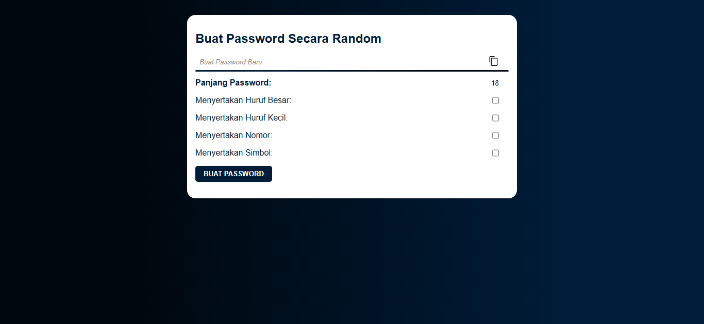

# 🔐 Password Generator

Aplikasi sederhana berbasis **HTML, CSS, dan JavaScript** untuk membuat password secara random dengan berbagai opsi keamanan.

---

## 🚀 Tampilan Aplikasi

---

## ✨ Fitur
- Generate password otomatis
- Atur panjang password
- Pilihan:
  - Huruf besar (A-Z)
  - Huruf kecil (a-z)
  - Angka (0-9)
  - Simbol (!@#$%^&*)
- Copy password ke clipboard

---

## 🛠 Teknologi
- HTML
- CSS
- JavaScript

---

---

## 💡 Cara Kerja
JavaScript akan:
1. Mengambil input dari user (panjang password & opsi)
2. Menggabungkan karakter sesuai pilihan
3. Mengacak karakter
4. Menampilkan password secara random

---

## 🧑‍💻 Author
**Bang Sesa**

---

## ⭐ Dukungan
Jika project ini bermanfaat, jangan lupa berikan ⭐ di repository ini!